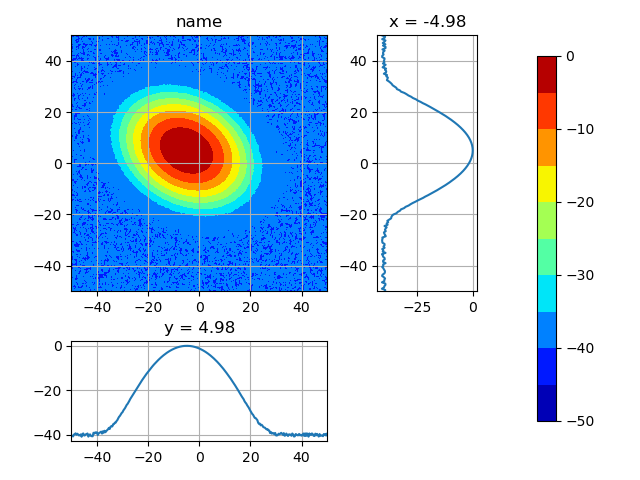
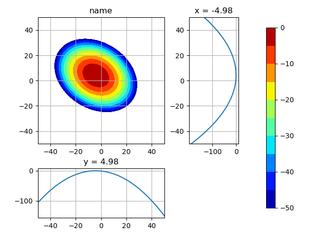
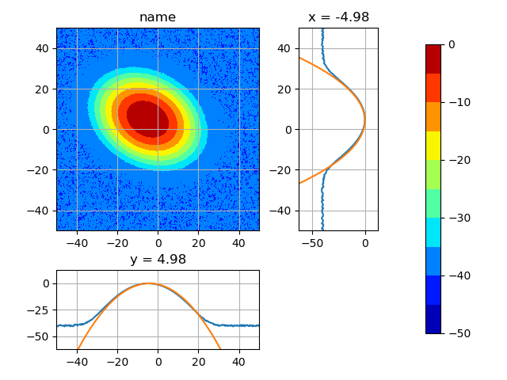
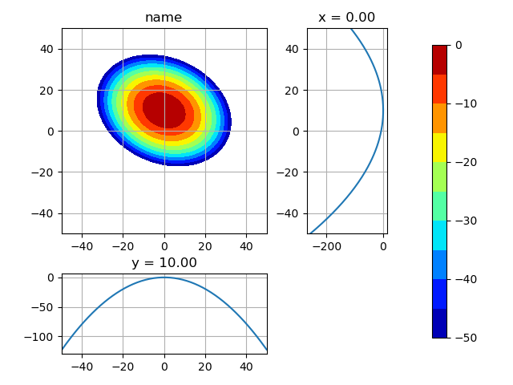
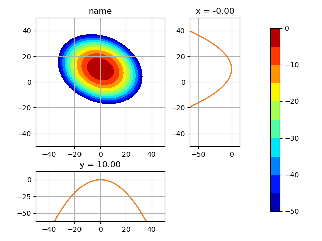
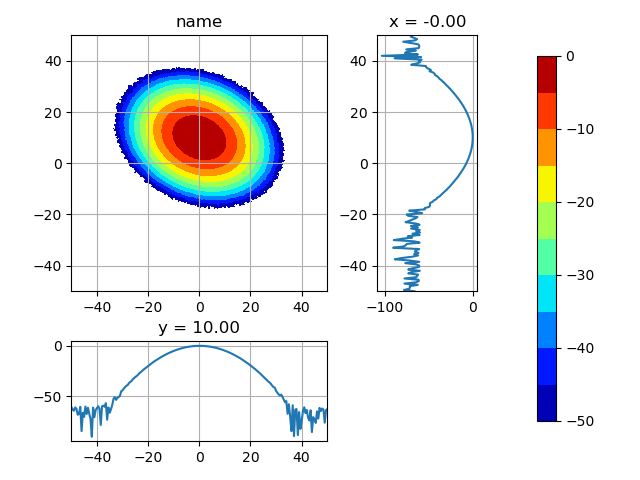
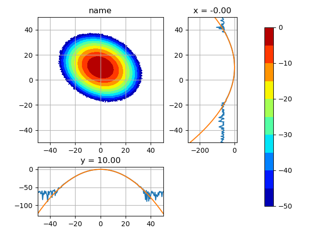
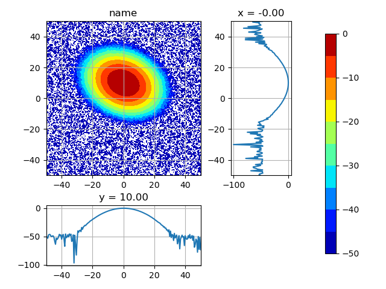
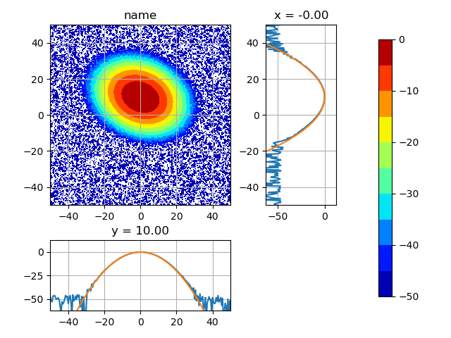

|                                |                                  |
| ------------------------------ | -------------------------------- | -------------------------------------- |
|  |  |  |
|  |  |  |
|  |  |  |
|  |  |  |

## Multivariate Gaussian distribution

- <https://en.wikipedia.org/wiki/Multivariate_normal_distribution>
- <https://stackoverflow.com/questions/47936890/how-to-calculate-the-angle-of-ellipse-gaussian-distribution>

$$ f(x,y) = \frac{1}{2\pi\sigma_X\sigma_Y\sqrt{1-\rho^2}} \exp( -\frac{1}{2(1-\rho^2)} [ \frac{(x-\mu_X)^2}{\sigma_X^2} + \frac{(y-\mu_Y)^2}{\sigma_Y^2} - \frac{2\rho(x-\mu_X)(y-\mu_Y)}{\sigma_X\sigma_Y} ] ) $$
$$ \mu = (\mu_X, \mu_Y)$$
$$ \Sigma = (\sigma_X^2, \rho\sigma_X\sigma_Y, \rho\sigma_X\sigma_Y, \sigma_Y^2)$$
